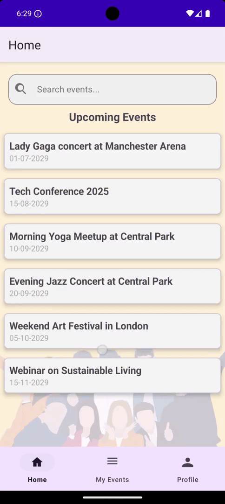
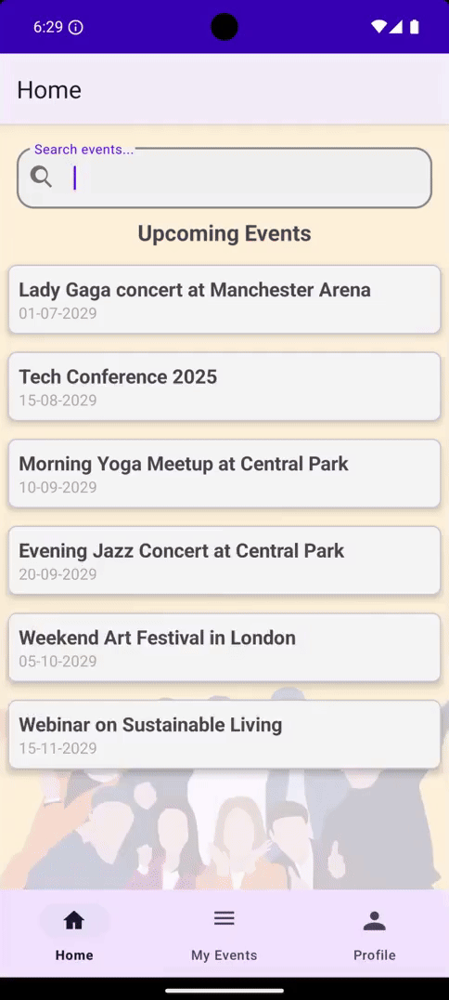
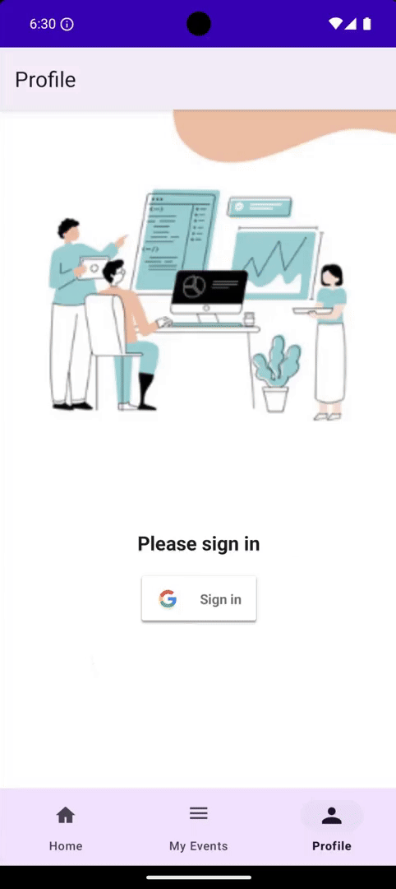
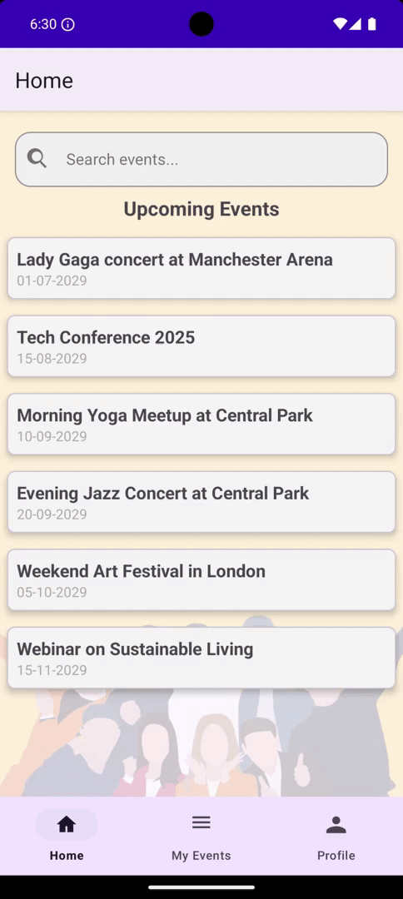
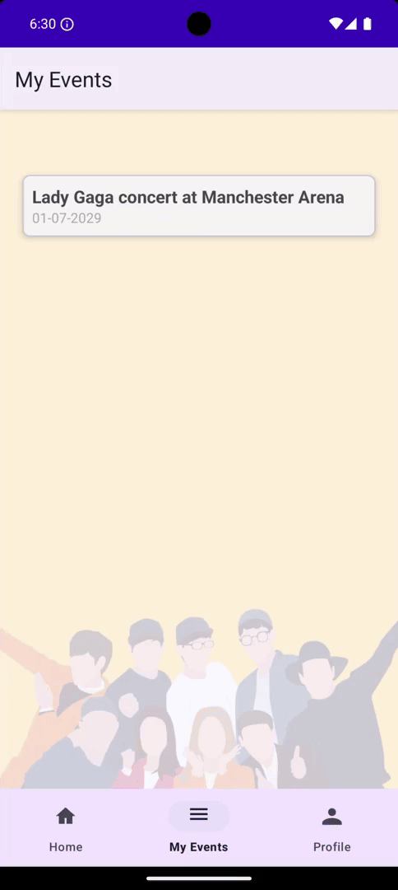

# Events Platform Android UI

This Android application allows users to browse events, sign up for them and add them to the user's Google calendar. It also includes administrative features for managing events and user roles.

Link to the back-end repository: [Java Events Platform API](https://github.com/andrei-vasiliu-coding/Events-Platform-API) 
---

## The application in action

### Home screen with events


### Search bar


### Sign in with Google


### Sign up for event


### Add event to Google Calendar


## 🎬 Demo

Watch the full demo on [YouTube](https://youtu.be/okMye-cVr7A).

## 🚀 Features

- User authentication via Google Sign-In.
- Event browsing and detailed view.
- Sign up for events with integration to Google Calendar.
- Admin functionality to create and manage events.

## 🛠️ Requirements

- Android Studio Flamingo or later
- Java 8+
- Firebase Account (Firestore, Authentication)
- Google API Credentials (OAuth 2.0 Client IDs)

## ⚙️ Setup Instructions

### 1. Clone the Repository

```bash
git clone <your-repo-url>
```

### 2. Open the Project

- Launch Android Studio and open the cloned project directory.

### 3. Firebase Configuration

- Go to [Firebase Console](https://console.firebase.google.com/) and create a new project.
- Register your Android app with the package name: `com.jveventsplatform.eventsplatformandroidui`
- Generate and download the `google-services.json` file from Firebase.
- Place `google-services.json` into your project's `app/` directory.

### 4. Google OAuth Setup

- Navigate to [Google Cloud Console](https://console.cloud.google.com/).
- Set up an OAuth 2.0 Client ID for Android.
- Add your SHA-1 fingerprint (Debug and Release fingerprints) to the credentials.

**Generate SHA-1 fingerprint:**

```bash
keytool -list -v -keystore ~/.android/debug.keystore -alias androiddebugkey -storepass android -keypass android
```

**For Release SHA-1:**

```bash
keytool -list -v -keystore <path-to-your-release-keystore.jks> -alias <your-key-alias>
```

- Enter these fingerprints into Firebase under Project Settings → Android App.

### 5. Configure the API

- The app relies on a backend REST API. Ensure your API server is running and that you POST events with Postman, unless you are an admin and can add events throught the application's UI.
- Update the API base URL in `RetrofitClient.kt` if necessary.

### 6. Firestore Database

- Start Firestore Database in Production or Test Mode (recommended Test initially).
- Configure security rules in your Firebase console.

#### Firebase Security Rules

This application uses Firebase Firestore. You must configure appropriate security rules to protect user data and ensure proper permissions.

A recommended minimum rule structure:

- Ensure users can only access their own data.
- Restrict event creation and modification to admin users.

**Important:** Always configure your own rules securely in your Firebase Console.

### 7. Set up Keystore for Release Builds

- Create `keystore.properties` in your project root directory:

```properties
storeFile=./app/Android_Release_Keys/release-keystore.jks
storePassword=your_keystore_password
keyAlias=your_key_alias
keyPassword=your_key_password
```

### 8. Install Dependencies

- Dependencies will be automatically handled by Gradle.
- Sync your project with Gradle files (`File → Sync Project with Gradle Files`).

### 9. Run the App

- Connect an Android device or emulator.
- Run the application by clicking the Run button or pressing `Shift+F10`.

## 🧑‍💻 Development

- **Admin Features:** Admin users can manage events and user roles via the Admin panel accessible through the Profile fragment.
- **Debugging:** Use Android Studio's Logcat for debugging.

## 🛡 Security Recommendations

- **Never commit sensitive information** (API keys, keystore passwords) to version control. Always use `keystore.properties` or environment variables.

## 🔮 Future Improvements

### 🛠️ Admin Features
- Ability for admins to **update** existing events  
- Ability for admins to **delete** events  
- View a list of users and their roles (e.g., promote/demote users)

### 🎨 UI/UX Enhancements
- Redesign **Add Event** form for a cleaner and more modern layout  
- Use **DatePicker** and **TimePicker** dialogs instead of manual text input  
- Improve spacing, padding, and accessibility  
- Add **loading indicators** during long operations (e.g. sign-in, API calls)

### 📅 Google Calendar Integration
- Add a toggle for users to choose whether to add events to their calendar  
- Show calendar sync confirmation or status

### 🔍 Event Filtering & Search
- Add filters by event type, city, price range, etc.  
- Use tags or categories for faster navigation

### 🔐 Authentication & Authorization
- Add better error handling for failed login/signup  
- Improve feedback for permission-denied errors

### 📡 Offline Support
- Cache event data locally with **Room** or Firestore’s offline persistence  
- Support offline event sign-ups and sync them when reconnected

### 📊 Analytics & Notifications
- Integrate **Firebase Analytics** to track user behavior  
- Add **Firebase Cloud Messaging (FCM)** for event reminders or updates

### 🧪 Testing & QA
- Write **unit tests** for critical logic  
- Add **instrumentation tests** for UI flow  
- Use **Firebase Test Lab** for automated device testing

### 🚀 Deployment & Monitoring
- Store user IDs and the event IDs they sign up for in a table for more efficient retrieval instead of storing the entire event information with the user ID.
- Prepare a signed release and publish to the Play Store  
- Use **Firebase Crashlytics** for real-time crash reports  

## 📖 Helpful Documentation

- [Firebase Android Setup](https://firebase.google.com/docs/android/setup)
- [Google Sign-In for Android](https://developers.google.com/identity/sign-in/android/start-integrating)

## 📌 Contributing

Contributions are welcome! Please fork the repository and submit a pull request.

## 📝 License

This project is licensed under the MIT License.


